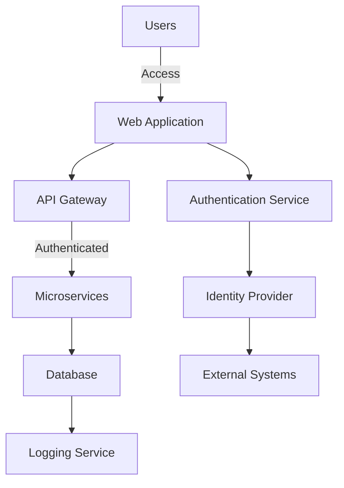
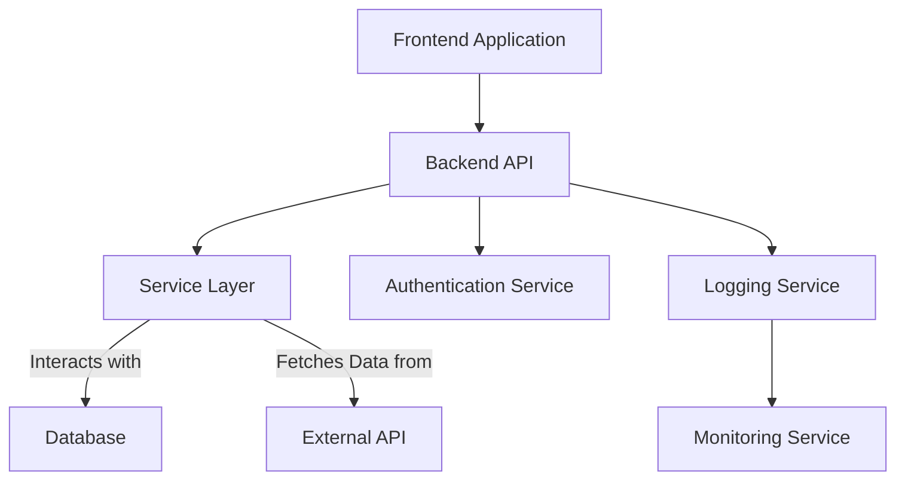
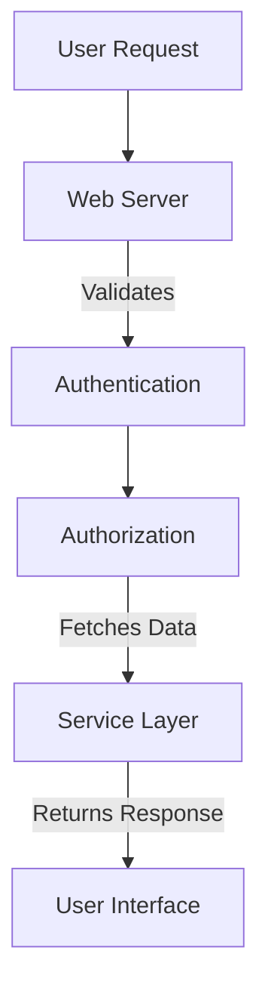
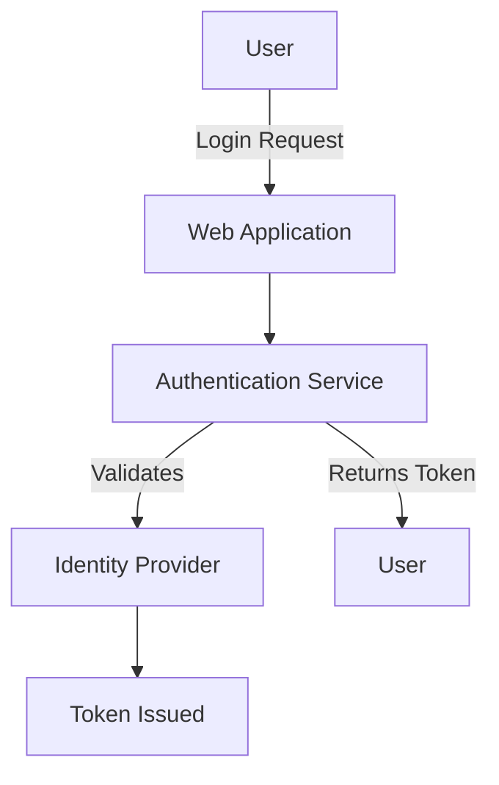
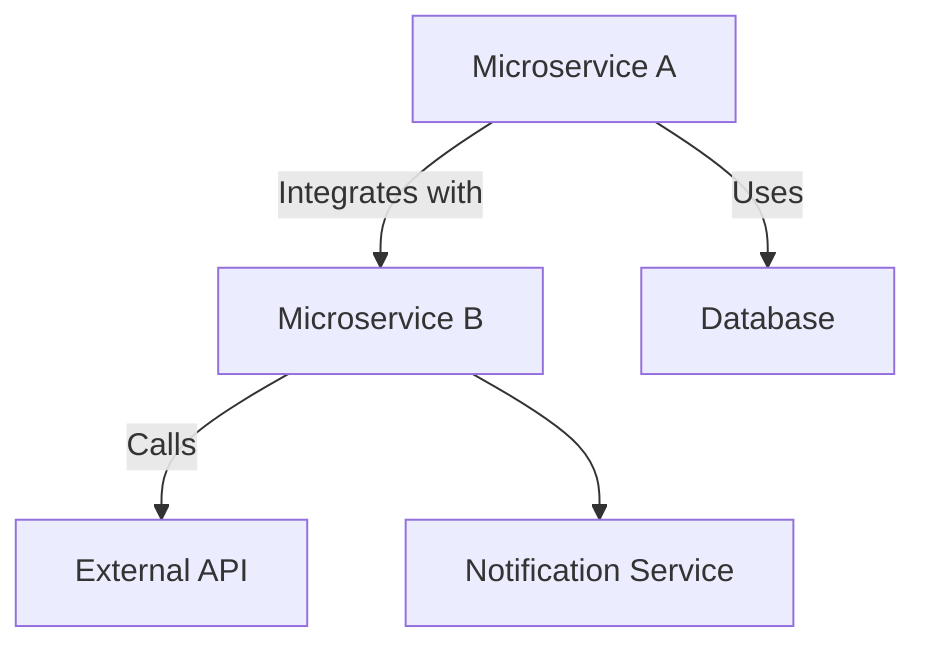
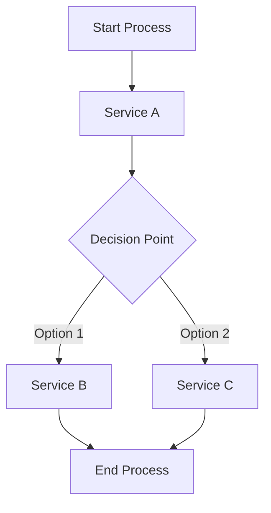
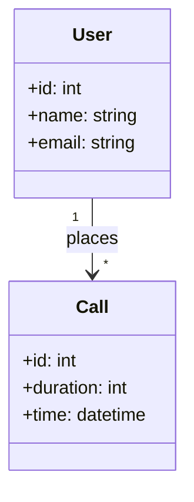
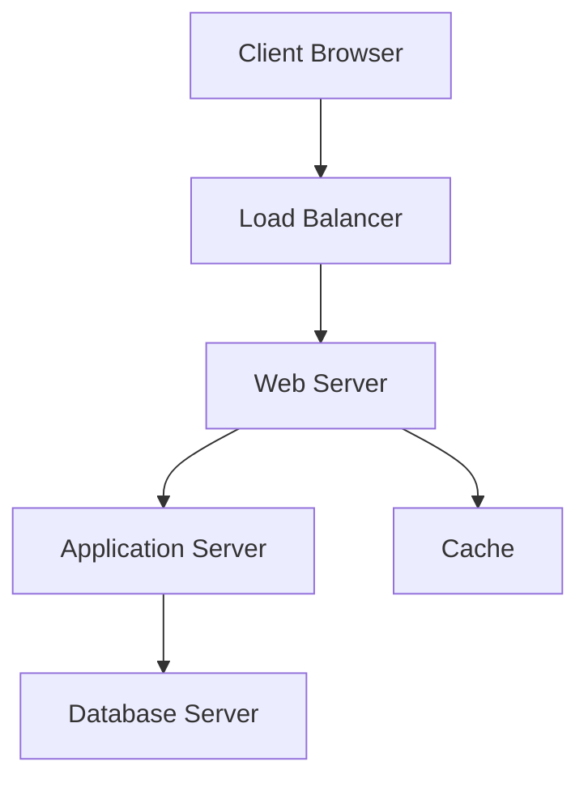

# Architecture Diagrams for Teams Telephony Manager Solution

## High-Level Security Architecture

## Detailed Technical Architecture

## Data Flow

## Security Authentication Flow

## Integration Points

## Workflow Orchestration

## Data Model Relationships

## Deployment Architecture

---
These diagrams represent a comprehensive overview of the Teams Telephony Manager solution, showcasing various aspects of its architecture including security, data flow, and deployment.